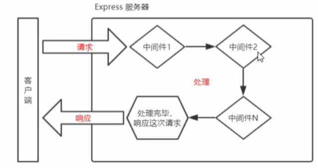

# 一：node中的模块
Node中根据模块来源不同，将模块分为了3大类，分别是：
- 内置模块：由Node.js官方提供，例如fs,path,http等
- 自定义模块：用户创建的每个.js文件，都是自定义模块
- 第三方模块，使用前需要下载
## 1. fs文件系统模块

### 1.1 文件读写
fs模块是官方提供的用来操作文件的模块。提供了一系列的方法和属性，用于满足用户对文件的操作需求。例：
- `fs.readFile()` 读取指定文件中的内容  `fs.readFile(path[,options], callback)`  中括号表示可选参数
- `fs.writeFile()` 向指定文件写入内容  `fs.writeFile(file, data[,options], callback)`

**路径的动态拼接：**
在使用fs模块操作文件时，如果提供的操作路径是以./或者../开头的相对路径时，容易出现路径动态拼接错误的问题。
- 原因：代码在运行时，会以执行node命令时所处的目录，动态拼接出被操作文件的完整路径
- 解决方式：使用__dirname`fs.writeFile(__dirname +  '/files/2.txt','abcd',function(err){})`


## 2. path路径模块
path模块是Node.js官方提供的，用来处理路径的模块。提供了一系列的方法和属性，用来满足用户对路径的处理需求
- `path.join()`方法，用于将多个路径片段拼接成一个完整的路径字符串。尽量使用`path.join`代替'+'进行路径拼接
- `path.basename()`方法，用来从路径字符串中，将文件名解析出来。`path.basename(fpath,'.html')`，输出不含扩展名的文件名
- `path.extname()`方法，获取文件的扩展名

## 3. http模块
http模块是官方提供的、用来创建web服务器的模块。创建一个web服务器的基本步骤包括：
1. 导入http模块
2. 创建web服务器实例
3. 为服务器实例绑定request事件，监听客户端的请求
4. 启动服务器
``` js
//导入http模块
const http = require('http')

//创建一个服务器实例
const server = http.createServer()

//为服务器实例绑定request事件，监听客户端请求,动态响应内容
server.on('request',(req,res)=>{
    //1.获取请求的url地址
    const url = req.url
    const methods = req.method
    let content = '<h1>404 not found</h1>'

    if(url === '/' || url ==='/index.html'){
        content = '<h1>首页</h1>'
    }else if( url === '/about.html' ){
        content = '<h1>关于</h1>'
    }

    res.setHeader('Content-Type','text/html;charset=utf-8')
    res.end(content)
})


//启动服务器
server.listen(80, function () { 
    console.log('server running at http://127.0.0.1:80');
 })
```

# 二、node中的模块化

> - 模块作用域
和函数作用域相似，在自定义模块中定义的变量、方法等成员，只能在当前模块内被访问。这种模块级别的访问限制，叫做模块作用域
>- module对象:
在自定义对象中，可以使用module.exports对象，将模块内成员共享出去，供外界使用。外界使用require()方法导入自定义模块中的内容。

## 1. commonJS规范
Node.js中常采用 CommonJS 模块规范，主要提供了module、exports、require、global几个环境变量来实现模块化。每个文件就是一个模块，有自己的作用域。在一个文件里面定义的变量、函数、类，都是私有的，对其他文件不可见。commonjs采用同步的方式加载模块，在服务端，这种方式不会出现问题，因为模块文件都存在本地，读取速度很快。但是如果在网页端使用commonjs方式进行模块化，由于网络的原因，就可能出现加载问题，所以nodejs是commonjs的最佳实践。主要规定了：
1. 每个模块内部，module变量代表当前模块
2. module变量是一个对象，它的exports属性（即module.exports）是对外的接口
3. 加载某个模块，其实是加载该模块的module.exports属性。require()方法用于加载模块

**模块的加载机制：**
- CommonJS模块的加载机制是，输入的是被输出的值的拷贝。也就是说，**一旦输出一个值，模块内部的变化就影响不到这个值**。主要是因为输出的值是个原始数据类型的值，会被缓存，引用类型则不一定。这点与ES6模块化有重大差异
- **首先使用./或者../的形式加载自定义模块：**在使用require导入自定义模块时，如果省略了文件的扩展名，则Node.js会按照顺序分别从尝试加载以下文件：
  - 按照确切的文件名进行加载
  - 补全.js扩展名加载
  - 补全.json扩展名加载
  - 补全.node扩展名加载
  - 加载失败，终端报错
- 如果传递给require()的模块标识符不是一个内置模块，则Node.js会从当前模块的父目录开始，尝试从`/node_modules`文件夹中加载第三方模块。**如果没有找到对应的第三方模块，则移动到再上一层父目录中进行加载，直到系统的根目录**
# 三、Express框架

定义：基于Node.js平台，快速，开发，极简的web开发框架，基于Node.js内置的http模块封装，是用于专门创建web服务器的。本质上时npm上的第三方包，提供了快速创建Web服务器的便捷方法。

## 1. 创建基本的服务器

``` js
//导入express
const express = require('express')

//创建web服务器
const app = express()

//监听GET请求，获取query参数

app.get('/user',(req,res)=>{  //req:请求头  res：响应头
    //res.send()方法向客户端响应一个JSON对象
    res.send({name:'111',age:20})
    //返回query阐述
   console.log(req.query())
   res.send(req.query)
})

//监听POST请求
app.post('/user',(req,res)=>{
    res.send('请求成功')
})

//获取动态参数
app.get('/user/:id',(req,res)=>{   //user/zy，返回的是zy
    //req.params默认是一个空对象
    // 里面存放着通过:动态匹配到的参数值
    console.log(req.params)  //动态匹配到的url参数
    res.send(req.params)
})


//启动web服务器
app.listen(80,()=>{
    console.log('Server running at 127.0.0.1:80')
})
```
## 2. 托管静态资源
1. express.static()
使用`express.static()`方法，可以方便的创建一个静态资源服务器，使得public目录下的图片、css文件、JavaScript文件对外开放。Express在指定的静态目录中查找文件，并对外提供资源的访问路径。因此，**存放静态文件的目录名不会出现在URL中**。
```js

app.use(express.static('../images'))
```
当托管多个静态资源目录时，会多次调用express.static()函数，并按顺序查找所需文件。如果在当前目录中查找到所需文件，则直接返回，不执行后续文件。

## 3. 路由模块
在Express中，路由指的是客户端的请求与服务器处理函数之间的映射关系。Express中的路由主要由三部分组成，分别是请求的类型、请求的URL地址、处理函数。`app.METHOD(PATH,HANDLER)`。
**路由模块化：**为了方便的对路由进行模块化管理，Express不建议将路由直接挂在到APP上，而是推荐将路由抽离为单独的模块。将路由抽离为单独的模块步骤如下：
- 创建路由模块对应的.js文件
``` js
const express = require('express')
```
- 调用express.Router()函数创建路由对象
``` js
const router = express.Router()
```
- 向路由对象上挂在具体的路由
``` js
router.get('/user/list',function (req,res) { 
    res.send('Get user List')
 })

 router.post('/user/add',function(req,res){
    res.send('Add new user')
 })
```
- 使用module.exports向外共享路由对象
``` js
 module.exports = router
```
- 使用app.use()函数注册路由模块
``` js
//导入路由模块
const router = require('./rout')
//注册路由模块
app.use(router)
```

## 4. 中间件
### 4.1 概念
中间件的思想为洋葱模型 ,从外到内依次执行中间件。有了中间件的存在，我们将那些固定功能的代码封装起来，在每次访问路由后自动去执行我们用到的所有中间件，我们只需要把注意力放在编写我们的业务逻辑代码便可。Express中的中间件，本质上是一个function处理函数。


- 在中间件函数的形参列表中，**必须包含next参数**，即`app.get('/',function(req,res,next){})`.
在路由中，处理函数只包含req和res。
- **多个中间件之间，共享一份req和res**。基于这样的特性，我们可以在上游的中间件中，统一为req或res对象添加自定义的属性或者方法，供下游的中间件或路由进行使用。
- 当定义多个全局中间件时，**按照注册顺序**执行中间件

### 4.2 next函数
next函数是实现多个中间件连续调用的关键，它表示把流转关系转交给下一个中间件或路由。


